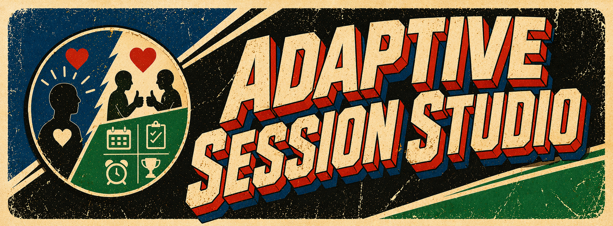

## Adaptive Session Studio


A fully local, browser-native environment for designing and running immersive adaptive adult sessions — combining media playback, haptic scripting, behavioral automation, and real-time adaptive control.

Built for experienced users who want flexibility and control without relying on paid apps, cloud services, or accounts. Adaptive Session Studio brings together full audio/video media playback, scripting, automation, and real-time interactions into a single, self-contained, *easy to use* toolkit.

📣 **Discord**: [discord.gg/G6qD35nag7](https://discord.gg/G6qD35nag7)

---

## What Is Adaptive Session Studio?

Adaptive Session Studio is a desktop-first creative platform that runs entirely in your browser, locally on your machine. There are no accounts, no external dependencies during playback, and no ongoing internet requirement. Your private sessions, media, and data stay entirely on your device and under your control.

At its core, the Studio lets you author structured, time-based, consensual adult play sessions combining:

- **Text overlays and timed prompts** displayed on-screen during playback
- **Text-to-speech narration** synthesized from your scripts
- **Background audio and video layers** with playlist and crossfade control
- **Subtitle scripting** via `.ass` / `.ssa` files
- **FunScript haptic control** — time-coded position scripts played to devices via Intiface Central
- **Behavioral scripting** — rules that react to attention, intensity, and engagement metrics
- **Hypnotic visualization blocks** — five canvas animations (Spiral, Pendulum, Tunnel, Pulse, Vortex)
- **AI-assisted authoring** — generate session content from a text prompt via the Anthropic API

All of this is orchestrated through an intuitive session timeline with granular control over depth, speed, pacing, transitions, and interactivity.

## Possible Use Cases
Solo play:
- Guided relaxation, meditation.
- Breathing exercises
- Increase mindfulness and focus
- Guided audio-visual experiences
- Personal training or improvement
- Pacing exercises or muscle relaxation
- Hypnosis and hypnotic induction

With a partner (local)
- Structured or guided discipline
- Behavioral conditioning with attention-driven reward/correction
- Partner training sessions with live operator controls
- Consensual surrender experiences with adaptive escalation

With a partner (Online)
- For your own safety and security, this app is designed to be used for OFFLINE play only. For your own personal privacy, please DO **NOT** use this app Online.

---

## A Fully Integrated Creative Workflow

Adaptive Session Studio isn't just a player — it's a complete authoring environment.

You can build sessions from the ground up using timed blocks, layering narration, visuals, and effects in a way that feels closer to video editing than traditional scripting. Background media can loop or sequence dynamically, while overlays and subtitles allow for precise visual communication.

For more advanced creators, the platform includes:

**Macro Library & Injection Engine**  
Create reusable behavioral or motion patterns and inject them live into a running session with smooth blending.

**Multi-track FunScript Support**  
Design and edit haptic timelines with an interactive canvas editor, enabling complex, synchronized motion sequences. Includes 11 pre-built patterns and a BPM-synced generator.

**8 Session Modes**  
One-click session presets: Exposure Therapy, Mindfulness/Focus, Deep Focus, Free Run, Guided Induction, Behavioral Conditioning, Operator-Led Training, and Deep Surrender. Each configures rules, ramps, and pacing automatically.

**6 Content Packs**  
Ready-to-run session templates: Classic Induction, Conditioning Foundation, Partner Intro, Solo Surrender, Grounding Reset, and Spiral Descent.

**Subtitle Styling with `.ass`**  
Import and override styles, language, positioning, and formatting for highly customized visual presentations.

---

## Real-Time Interaction & Adaptation

Where Adaptive Session Studio truly stands out is in its ability to adapt in real time.

With built-in webcam-based attention tracking, sessions can respond dynamically to user engagement — pausing playback, halting motion, or triggering macros based on attention state. Combined with live macro injection, sessions become responsive experience events rather than static timelines.

The **Sensor Bridge** (WebSocket) lets external biometric devices (heart rate, GSR, EEG) feed live signals directly into the engagement engine, enabling truly physiologically-adaptive sessions.

---

## Progress & Profile System

The Studio tracks your journey with a full progression system:

- **XP & 20 Levels** — earn experience every session (Initiate → Apex)
- **71 Achievements** across 8 categories (19 hidden to discover)
  - First Steps, Consistency, Sessions, Endurance, Focus, Craft & Exploration, Quests, Levels
- **Daily Quests** — 3 rotating quests per day, deterministic from the date
- **Streak tracking**, monthly visit patterns, and focus quality metrics
- **Post-session debrief** — full breakdown of XP earned, achievements unlocked, quests completed
- All progress stored locally — entirely private, never uploaded

Achievement categories span everything from consistency (streaks, return visits) and depth (session counts) to craft (using advanced features like haptic, viz, scenes, rules) and precision (zero attention-loss sessions). Notifications for all four types can be toggled independently in Settings → Display / HUD.

---

## Designed for Local-First Privacy and Reliability

Everything in Adaptive Session Studio runs locally:

- No cloud processing
- No data collection
- No external dependencies during playback

This makes it ideal for users and their partners who prioritize personal safety, privacy, reliability, and offline capability. Once installed, the entire system operates independently via a standard Chromium-based browser.

---

## Safety as a Core Principle

Because Adaptive Session Studio can integrate with external devices and continuous playback systems, safety is treated as a first-class concern:

- **Immediate emergency stop** via `ESC` — smoothly ramps device to zero before stopping
- Hard intensity and speed limits configurable per session
- Emergency cooldown prevents accidental re-trigger
- Clear operational warnings and best practices

---

## Key Features at a Glance

| Category | Features |
|----------|----------|
| **Content** | Text, TTS, audio, video, pause, macro, and visualization blocks |
| **Haptic** | Multi-track FunScript, 11 patterns, BPM generator, timeline canvas editor |
| **Behavioral** | Rules engine, trigger windows, state blocks (calm/build/peak/recovery) |
| **Adaptive** | Webcam attention tracking, sensor bridge, dynamic pacing, intensity ramp |
| **Modes** | 8 one-click session presets, 6 ready-to-run content packs |
| **Variables** | Named runtime variables with `{{varName}}` template support in blocks |
| **AI Authoring** | Generate full session JSON from a text prompt (requires Anthropic API key) |
| **Profile** | XP, 20 levels, 71 achievements, daily quests, streaks, session analytics |
| **Safety** | Hard limits, ESC emergency stop, emergency cooldown |
| **Privacy** | 100% local — no accounts, no cloud, no telemetry |

---

## Getting Started

Getting up and running in under 5 minutes:

1. **Install prerequisites**
   - [Apache Server 2.4](https://httpd.apache.org/download.cgi) or later  
   - (Optional) [Python 3.x](https://www.python.org/downloads/windows/) for simpler serving

2. **Deploy the app**  
   Unzip this package into your server's web root (default: `C:\Apache24\htdocs`). Replace the existing `index.html` with the contents of this project.

3. Open Run... `Win+R`. Type `cmd` and hit enter. Now, change the directory to your Apache Server folder: `cd C:\Apache24\bin`

Choose how to proceed
 
Option 1) **Start server manually**
   ```
   httpd.exe
   ```

 Option 2) **Run as a Windows service** (always on web server)
   ```
   httpd.exe -k install -n "Apache Server"
   ```

4. **Open in browser**  
   On the same system as the Apache Server, navigate to `http://localhost:80` in Chrome, Edge, Safari, or Firefox.

5. **Start a session**  
   Load a Content Pack to start immediately, or build your own session from scratch.

> **When done:** Stop the server with `httpd.exe -k shutdown` in the same directory.
>If Apache was not installed as a service, it will require manual start/stop every time.

>To uninstall the "Apache Server" Windows service: `httpd.exe -k uninstall`

Questions? Join the [Discord](https://discord.gg/G6qD35nag7) for community help and setup support.

---

## Documentation

| Document | Description |
|---|---|
| [docs/CHANGELOG.md](docs/CHANGELOG.md) | Version history and patch notes |

> **Extended documentation** (install guides, feature walkthroughs, API reference, safety guidelines) is in progress and will be published separately. Join the [Discord](https://discord.gg/G6qD35nag7) for the latest updates and community guides.

---

## Keyboard Shortcuts

| Key | Action |
|-----|--------|
| `Space` | Play / Pause |
| `Enter` | Stop |
| `ESC`   | Emergency stop |
| `F` | Toggle fullscreen |
| `N` | Next scene |
| `E` | Toggle FunScript edit mode |
| `A` | Toggle attention tracking |
| `D` | Toggle device connection |
| `Shift` | Toggle FunScript pause |
| `← →` | Skip ±10 seconds |
| `↑ ↓` | Skip ±30 seconds |
| `1–5` | Inject macro slot |
| `[ / ]` | Intensity −10% / +10% |
| `, / .` | Speed −0.1× / +0.1× |
| `R` | Reset live controls |
| `Ctrl+Z / Y` | Undo / Redo |
| `Ctrl+S` | Export session as `.assp` |
| `Ctrl+0` | Reset timeline zoom |
| `Ctrl+,` | Open settings |
| `?` | Shortcut overlay |

---

## Session File Format

Sessions are saved as `.assp` files (raw JSON). The file is a direct serialisation of the session object — not a zip archive. The core session object contains:

- `blocks[]` — timed content blocks (text, TTS, audio, video, pause, macro, visualization)
- `scenes[]` — named time ranges with optional state types (calm/build/peak/recovery)
- `rules[]` — behavioral scripting rules (condition → action)
- `triggers[]` — time-window interaction checks with success/failure branches
- `funscriptTracks[]` — haptic position timelines
- `playlists.audio[]`, `playlists.video[]`, `subtitleTracks[]`
- `rampSettings`, `pacingSettings`, `safetySettings`, `speechSettings`, `funscriptSettings`
- `macroLibrary[]`, `macroSlots{1–5}`
- `variables{}` — named runtime variables with `{{varName}}` template support
- `hudOptions`, `displayOptions` — HUD visibility and notification preferences

---

## Module Architecture

39 ES modules, no build step, no framework.

| Module | Role |
|--------|------|
| `main.js` | Bootstrap, DOM event wiring, keyboard handler |
| `state.js` | Session state, normalizers, IDB persistence |
| `playback.js` | RAF loop, block execution, template resolution |
| `ui.js` | Sidebar, inspector tabs, settings form rendering |
| `funscript.js` | Multi-lane timeline canvas, FunScript interpolation |
| `audio-engine.js` | Web Audio API, playlist, crossfade |
| `state-engine.js` | Real-time metric fusion (attention × device × intensity) |
| `rules-engine.js` | Behavioral scripting with conditioning presets |
| `trigger-windows.js` | Timed interaction windows with success/fail branches |
| `safety.js` | Hard intensity/speed limits, emergency cooldown |
| `intensity-ramp.js` | Configurable intensity ramp curves (time/engagement/step/adaptive) |
| `dynamic-pacing.js` | Engagement-driven speed modulation with EMA smoothing |
| `session-modes.js` | 8 preset session configurations |
| `ai-authoring.js` | LLM-assisted session generation via Anthropic API |
| `live-control.js` | Real-time sliders with safety clamps |
| `macros.js` | FunScript macro library, key slots, injection |
| `macro-ui.js` | Macro library and inline editor rendering |
| `scenes.js` | Scene CRUD, timeline markers, skip navigation |
| `tracking.js` | Webcam FaceDetector, attention scoring, decay |
| `session-analytics.js` | Post-session data accumulation, debrief modal |
| `user-profile.js` | XP, achievements, streaks, milestones, profile panel |
| `achievements.js` | 71 achievements, daily quests, XP/level system |
| `suggestions.js` | Real-time session health suggestions (15 checks) |
| `subtitle.js` | ASS/SSA parsing and rendering |
| `notify.js` | Toast notification system with confirm dialogs |
| `history.js` | Undo/redo with snapshot model (60-step cap) |
| `capabilities.js` | Browser feature detection and capability gates |
| `block-ops.js` | Block duplicate/delete/reorder operations |
| `fullscreen-hud.js` | Fullscreen overlay HUD rendering |
| `idb-storage.js` | Async IndexedDB wrapper with localStorage migration |
| `plugin-host.js` | Plugin manifest validation, capabilities, sandbox lifecycle |
| `content-packs.js` | 6 pre-built session templates |
| `import-validate.js` | Session file validation and size/structure guards |
| `metrics-history.js` | Daily metrics IDB storage, SVG activity chart, CSV/JSON import |
| `state-blocks.js` | State Block profiles (calm/build/peak/recovery) |
| `variables.js` | User-defined session variables, template resolution, CRUD |
| `sensor-bridge.js` | WebSocket bridge for biometric/sensor data |
| `funscript-patterns.js` | 11 pre-generated movement patterns + BPM-synced generator |
| `viz-blocks.js` | 5 canvas hypnotic visualizations |

---

## Feature Status

| Feature | Status | Module |
|---------|--------|--------|
| Timeline-based session designer | ✅ Complete | `playback.js`, `ui.js` |
| Behavioral Scripting (rules) | ✅ Complete | `rules-engine.js` |
| Timed Interaction Windows | ✅ Complete | `trigger-windows.js` |
| State Engine + Multi-Signal Fusion | ✅ Complete | `state-engine.js` |
| Webcam Attention Tracking | ✅ Complete | `tracking.js` |
| Adaptive Pacing + Intensity Ramp | ✅ Complete | `dynamic-pacing.js`, `intensity-ramp.js` |
| Safety Layer | ✅ Complete | `safety.js` |
| 8 Session Modes | ✅ Complete | `session-modes.js` |
| 6 Content Packs | ✅ Complete | `content-packs.js` |
| Multi-track FunScript + Canvas Editor | ✅ Complete | `funscript.js` |
| 11 FunScript Patterns + BPM Generator | ✅ Complete | `funscript-patterns.js` |
| 5 Hypnotic Visualization Blocks | ✅ Complete | `viz-blocks.js` |
| Macro Library + Live Injection | ✅ Complete | `macros.js`, `macro-ui.js` |
| Scene System with State Blocks | ✅ Complete | `scenes.js`, `state-blocks.js` |
| User-Defined Variables + `{{templates}}` | ✅ Complete | `variables.js` |
| AI-Assisted Session Authoring | ✅ Complete | `ai-authoring.js` |
| Sensor Bridge (WebSocket biometrics) | ✅ Complete | `sensor-bridge.js` |
| Post-Session Analytics + History | ✅ Complete | `session-analytics.js`, `metrics-history.js` |
| XP / Level / Achievement System | ✅ Complete | `achievements.js` |
| Daily Quests (15 types, 3/day) | ✅ Complete | `achievements.js` |
| User Profile + Progress Panel | ✅ Complete | `user-profile.js` |
| Plugin Host + Capability API | ✅ Complete | `plugin-host.js` |
| Undo / Redo (60-step) | ✅ Complete | `history.js` |
| Session Import / Export (`.assp`) | ✅ Complete | `import-validate.js` |
| Remote play | 🔜 Planned | — |

---

## Safety Notes

**NEVER LEAVE YOUR Apache Server RUNNING** when not in use.
**ALWAYS UNPLUG or COVER YOUR WEBCAM** when not in use.

---

## Building a Community Around Creation

As the platform evolves, we're inviting creators, developers, and enthusiasts to:

- Share session designs and ideas
- Build reusable macros and templates
- Contribute to development, tooling, and extensions
- Help shape the future of adaptive, interactive adult media
- Join us on Discord: https://discord.gg/G6qD35nag7

---

## FAQ

**Q: Can I *actually* use this for hypnosis?**
> A: Only if free will doesn't exist.

**Q: Can I contribute?**
> A: Yes! If you can script, design, program, or want to design or test `.assp` session files, create FunScripts and macros, or help smooth out documentation, any help is greatly appreciated. Join our Discord community for interactions and sharing.

**Q: Was the name intentional? *A*daptive *S*ession *S*tudio. `.ass` and `.assp` files?**
> A: Believe it or not, it wasn't intentional. But we found it funny so we kept it.

**Q: Where can I get help?**
> A: Discord, please and thanks. Or email if you want to be professional.

---

## License

Personal use only. Not for commercial redistribution.

